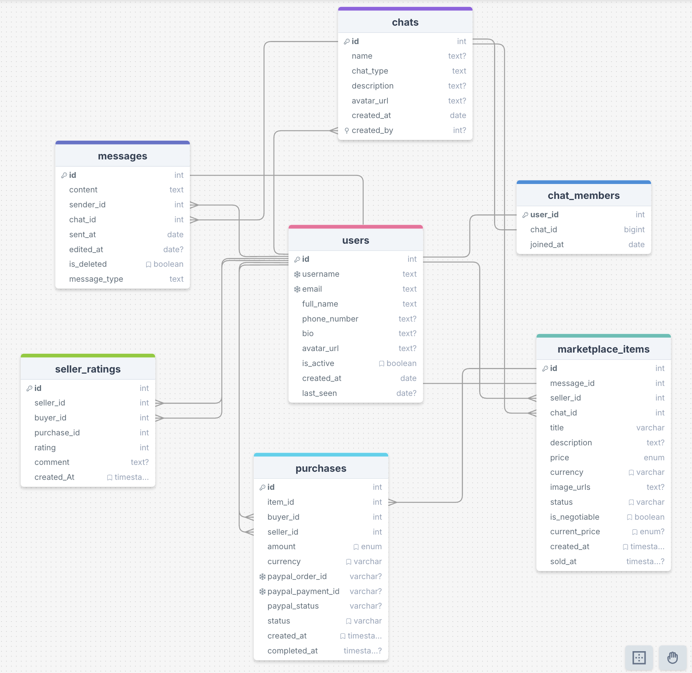

# Base de datos operativa (chatdb)

## General

La base de datos de una aplicación de mensajería con funciones de chats privados/grupales y un marketplace dentro de los chats. 

## Diagrama

A grandes rasgos, así se relacionan las tablas:

- Un usuario puede estar en muchos chats y cada chat puede tener muchos usuarios. Relación muchos‑a‑muchos se modela con `chat_members`, que además registra cuándo se unió el usuario.
- Un chat contiene muchos mensajes; cada mensaje pertenece a un único chat. Por eso `messages` tiene `chat_id`.
- Un usuario puede enviar muchos mensajes; cada mensaje tiene un único remitente. Por eso `messages` tiene `sender_id`.
- Algunos mensajes pueden transformarse en un listado de marketplace. Esa relación es uno‑a‑uno opcional: `marketplace_items.message_id` referencia al mensaje original.
- Cada listado pertenece a un chat (donde se publicó) y a un vendedor (el autor). Por eso `marketplace_items` guarda `chat_id` y `seller_id`.
- Una compra vincula un listado con un comprador y un vendedor. En `purchases` está `item_id`, `buyer_id` y `seller_id`.
- Cada compra puede generar exactamente una calificación del vendedor. Esa relación es uno‑a‑uno entre `purchases` y `seller_ratings` mediante `purchase_id` único.
- Las reglas de borrado en cascada mantienen la consistencia: si se elimina un usuario, se eliminan sus mensajes/listados/compras/calificaciones; si se elimina un chat, se eliminan sus mensajes y listados; si se elimina un mensaje listado, también desaparece el listado asociado.

## Entidades principales

### users
Representa a cada persona en la plataforma.
- id (PK)
- username (UNIQUE, NOT NULL)
- email (UNIQUE, NOT NULL)
- full_name (NOT NULL)
- phone_number (NULL)
- bio (NULL)
- avatar_url (NULL)
- is_active (BOOLEAN, por defecto true)
- created_at (TIMESTAMPTZ, por defecto now())
- last_seen (TIMESTAMPTZ, se actualiza en actividad)

Relaciones:
- 1:N con messages (un usuario envía muchos mensajes)
- M:N con chats mediante chat_members
- 1:N con marketplace_items (como vendedor)
- 1:N con purchases (como comprador y como vendedor)
- 1:N con seller_ratings (como vendedor calificado y como comprador que califica)

### chats
Conversaciones privadas o grupales.
- id (PK)
- name (NULL para chat privado)
- chat_type (NOT NULL: "private" | "group")
- description (NULL)
- avatar_url (NULL)
- created_at (TIMESTAMPTZ)
- created_by (FK → users.id, ON DELETE SET NULL)

Relaciones:
- 1:N con messages
- M:N con users mediante chat_members
- 1:N con marketplace_items (los listados pertenecen a un chat)

### chat_members (tabla de unión)
Membresías de usuarios en chats.
- user_id (PK, FK → users.id, ON DELETE CASCADE)
- chat_id (PK, FK → chats.id, ON DELETE CASCADE)
- joined_at (TIMESTAMPTZ)

### messages
Mensajes enviados en los chats.
- id (PK)
- content (NOT NULL)
- sender_id (FK → users.id, NOT NULL, ON DELETE CASCADE)
- chat_id (FK → chats.id, NOT NULL, ON DELETE CASCADE)
- sent_at (TIMESTAMPTZ)
- edited_at (TIMESTAMPTZ, NULL)
- is_deleted (BOOLEAN, por defecto false)
- message_type (por defecto "text")

Relaciones:
- 1:1 opcional con marketplace_items (un mensaje puede convertirse en un listado)

### marketplace_items
Listados de productos creados a partir de un mensaje.
- id (PK)
- message_id (FK → messages.id, UNIQUE, NOT NULL, ON DELETE CASCADE)
- seller_id (FK → users.id, NOT NULL, ON DELETE CASCADE)
- chat_id (FK → chats.id, NOT NULL, ON DELETE CASCADE)
- title (NOT NULL)
- description (NULL)
- price (NUMERIC(10,2), NOT NULL)
- currency (por defecto "USD")
- image_urls (TEXT, JSON de URLs, NULL)
- status (por defecto "active"; valores esperados: active|sold|cancelled|pending)
- is_negotiable (BOOLEAN, por defecto true)
- current_price (NUMERIC(10,2), NULL)
- created_at (TIMESTAMPTZ)
- sold_at (TIMESTAMPTZ, NULL)

Relaciones:
- 1:N con purchases (un listado puede tener varios intentos/registro de compras)

### purchases
Transacciones de compra de listados.
- id (PK)
- item_id (FK → marketplace_items.id, NOT NULL, ON DELETE CASCADE)
- buyer_id (FK → users.id, NOT NULL, ON DELETE CASCADE)
- seller_id (FK → users.id, NOT NULL, ON DELETE CASCADE)
- amount (NUMERIC(10,2), NOT NULL)
- currency (por defecto "USD")
- paypal_order_id (UNIQUE, NULL)
- paypal_payment_id (UNIQUE, NULL)
- paypal_status (NULL; created|approved|completed|cancelled)
- status (por defecto "pending"; pending|completed|cancelled|refunded)
- created_at (TIMESTAMPTZ)
- completed_at (TIMESTAMPTZ, NULL)

Relaciones:
- 1:1 con seller_ratings (cada compra puede tener a lo sumo una calificación)

### seller_ratings
Calificaciones de vendedores asociadas a compras específicas.
- id (PK)
- seller_id (FK → users.id, NOT NULL, ON DELETE CASCADE)
- buyer_id (FK → users.id, NOT NULL, ON DELETE CASCADE)
- purchase_id (FK → purchases.id, UNIQUE, NOT NULL, ON DELETE CASCADE)
- rating (INT, 1 a 5, NOT NULL)
- comment (TEXT, NULL)
- created_at (TIMESTAMPTZ)

## Relaciones clave y cardinalidades

- users ↔ chats: M:N mediante chat_members.
- users → messages: 1:N.
- chats → messages: 1:N.
- messages → marketplace_items: 1:1 opcional (solo algunos mensajes se convierten en listados).
- users → marketplace_items: 1:N (un vendedor puede tener muchos listados).
- chats → marketplace_items: 1:N (un chat puede alojar muchos listados).
- marketplace_items → purchases: 1:N.
- users → purchases: 1:N como comprador; 1:N como vendedor.
- purchases → seller_ratings: 1:1.

## Reglas de integridad y borrado

- ON DELETE CASCADE en chat_members, messages, marketplace_items, purchases y seller_ratings para evitar huérfanos.
- ON DELETE SET NULL en chats.created_by para conservar el chat aun si se borra el creador.

## Flujo funcional resumido

1. Un usuario crea o participa en un chat (chat_members).
2. Envía mensajes (messages). Algunos mensajes pueden convertirse en listados (marketplace_items) dentro del mismo chat.
3. Otros usuarios del chat pueden comprar esos listados (purchases). El vendedor y el comprador quedan registrados.
4. Tras una compra completada, el comprador puede calificar al vendedor (seller_ratings) exactamente una vez por compra.

