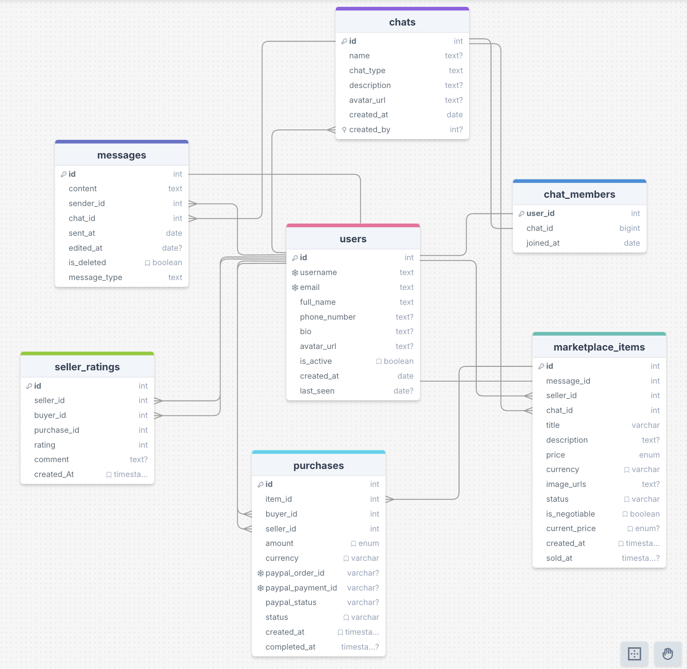

# Base de datos operativa (chatdb)

## General

La base de datos de una aplicación de mensajería con funciones de chats privados/grupales y un marketplace dentro de los chats. 

## Diagrama

A grandes rasgos, así se relacionan las tablas:

- Un usuario puede estar en muchos chats y cada chat puede tener muchos usuarios. Relación muchos‑a‑muchos se modela con `chat_members`, que además registra cuándo se unió el usuario.
- Un chat contiene muchos mensajes; cada mensaje pertenece a un único chat. Por eso `messages` tiene `chat_id`.
- Un usuario puede enviar muchos mensajes; cada mensaje tiene un único remitente. Por eso `messages` tiene `sender_id`.
- Algunos mensajes pueden transformarse en un listado de marketplace. Esa relación es uno‑a‑uno opcional: `marketplace_items.message_id` referencia al mensaje original.
- Cada listado pertenece a un chat (donde se publicó), a un vendedor (el autor) y puede etiquetarse con una categoría. Por eso `marketplace_items` guarda `chat_id`, `seller_id` y `category_id`.
- Los vendedores crean un `seller_profile` (1:1 con `users`) que se conecta con múltiples `marketplace_categories` mediante la tabla puente `seller_categories`.
- Las reglas de borrado en cascada mantienen la consistencia: si se elimina un usuario, se eliminan sus mensajes/listados/perfiles y vínculos de categoría; si se elimina un chat, se eliminan sus mensajes y listados; si se elimina un mensaje listado, también desaparece el listado asociado.

## Entidades principales

### users
Representa a cada persona en la plataforma.
- id (PK)
- username (UNIQUE, NOT NULL)
- email (UNIQUE, NOT NULL)
- full_name (NOT NULL)
- password_hash (NULL hasta que configure credenciales locales)
- phone_number (NULL)
- bio (NULL)
- avatar_url (NULL)
- is_active (BOOLEAN, por defecto true)
- created_at (TIMESTAMPTZ, por defecto now())
- last_seen (TIMESTAMPTZ, se actualiza en actividad)

Relaciones:
- 1:N con messages (un usuario envía muchos mensajes)
- M:N con chats mediante chat_members
- 1:N con marketplace_items (como vendedor)
- 1:1 opcional con seller_profiles (cada usuario puede tener un perfil de vendedor)

### chats
Conversaciones privadas o grupales.
- id (PK)
- name (NULL para chat privado)
- chat_type (NOT NULL: "private" | "group")
- description (NULL)
- avatar_url (NULL)
- created_at (TIMESTAMPTZ)
- created_by (FK → users.id, ON DELETE SET NULL)

Relaciones:
- 1:N con messages
- M:N con users mediante chat_members
- 1:N con marketplace_items (los listados pertenecen a un chat)

### chat_members (tabla de unión)
Membresías de usuarios en chats.
- user_id (PK, FK → users.id, ON DELETE CASCADE)
- chat_id (PK, FK → chats.id, ON DELETE CASCADE)
- joined_at (TIMESTAMPTZ)

### messages
Mensajes enviados en los chats.
- id (PK)
- content (NOT NULL)
- sender_id (FK → users.id, NOT NULL, ON DELETE CASCADE)
- chat_id (FK → chats.id, NOT NULL, ON DELETE CASCADE)
- sent_at (TIMESTAMPTZ)
- edited_at (TIMESTAMPTZ, NULL)
- is_deleted (BOOLEAN, por defecto false)
- message_type (por defecto "text")

Relaciones:
- 1:1 opcional con marketplace_items (un mensaje puede convertirse en un listado)

### marketplace_categories
Catálogo de categorías para organizar los listados.
- id (PK)
- name (UNIQUE, NOT NULL)
- description (NULL)
- created_at (TIMESTAMPTZ, por defecto now())

Relaciones:
- 1:N con marketplace_items (una categoría agrupa muchos listados)
- M:N con seller_profiles mediante seller_categories

### seller_profiles
Perfiles públicos opcionales que enriquecen la identidad del vendedor.
- id (PK)
- user_id (FK → users.id, UNIQUE, NOT NULL, ON DELETE CASCADE)
- display_name (NULL)
- bio (NULL)
- location (NULL)
- contact_info (NULL)
- created_at (TIMESTAMPTZ, por defecto now())
- updated_at (TIMESTAMPTZ, se refresca en cambios)

Relaciones:
- 1:1 con users (cada usuario tiene a lo sumo un perfil de vendedor)
- M:N con marketplace_categories mediante seller_categories

### seller_categories (tabla de unión)
Conecta perfiles de vendedor con las categorías que dominan.
- seller_profile_id (PK, FK → seller_profiles.id, ON DELETE CASCADE)
- category_id (PK, FK → marketplace_categories.id, ON DELETE CASCADE)
- linked_at (TIMESTAMPTZ, por defecto now())

### marketplace_items
Listados de productos creados a partir de un mensaje.
- id (PK)
- message_id (FK → messages.id, UNIQUE, NOT NULL, ON DELETE CASCADE)
- seller_id (FK → users.id, NOT NULL, ON DELETE CASCADE)
- chat_id (FK → chats.id, NOT NULL, ON DELETE CASCADE)
- category_id (FK → marketplace_categories.id, NULL, ON DELETE SET NULL)
- title (NOT NULL)
- description (NULL)
- price (NUMERIC(10,2), NOT NULL)
- currency (por defecto "USD")
- image_urls (TEXT, JSON de URLs, NULL)
- status (por defecto "active"; valores esperados: active|sold|cancelled|pending)
- is_negotiable (BOOLEAN, por defecto true)
- current_price (NUMERIC(10,2), NULL)
- created_at (TIMESTAMPTZ)
- sold_at (TIMESTAMPTZ, NULL)

Relaciones:
- 1:1 con messages (cada listado proviene de un único mensaje)
- N:1 con users (el vendedor original)
- N:1 con chats (el chat donde se publicó)
- N:1 opcional con marketplace_categories

## Relaciones clave y cardinalidades

- users ↔ chats: M:N mediante chat_members.
- users → messages: 1:N.
- chats → messages: 1:N.
- messages → marketplace_items: 1:1 opcional (solo algunos mensajes se convierten en listados).
- users → marketplace_items: 1:N (un vendedor puede tener muchos listados).
- chats → marketplace_items: 1:N (un chat puede alojar muchos listados).
- marketplace_items → marketplace_categories: N:1 opcional.
- users ↔ seller_profiles: 1:1 (un perfil por usuario).
- seller_profiles ↔ marketplace_categories: M:N mediante seller_categories.

## Reglas de integridad y borrado

- ON DELETE CASCADE en chat_members, messages, marketplace_items, seller_profiles y seller_categories para evitar huérfanos al eliminar usuarios o chats.
- ON DELETE SET NULL en chats.created_by y en marketplace_items.category_id para conservar el registro aun si el referente desaparece.

## Flujo funcional resumido

1. Un usuario crea o participa en un chat (chat_members) y mantiene su actividad en `users`.
2. Si desea vender, crea un `seller_profile` y lo vincula con categorías relevantes a través de `seller_categories`.
3. Envía mensajes (messages). Algunos mensajes se promueven a listados (`marketplace_items`) y se etiquetan con una categoría opcional (`marketplace_categories`).
4. Los miembros del chat consultan el listado, negocian dentro del mismo hilo (estatus + `current_price`) y gestionan el ciclo de vida del item (active → sold o cancelled).

